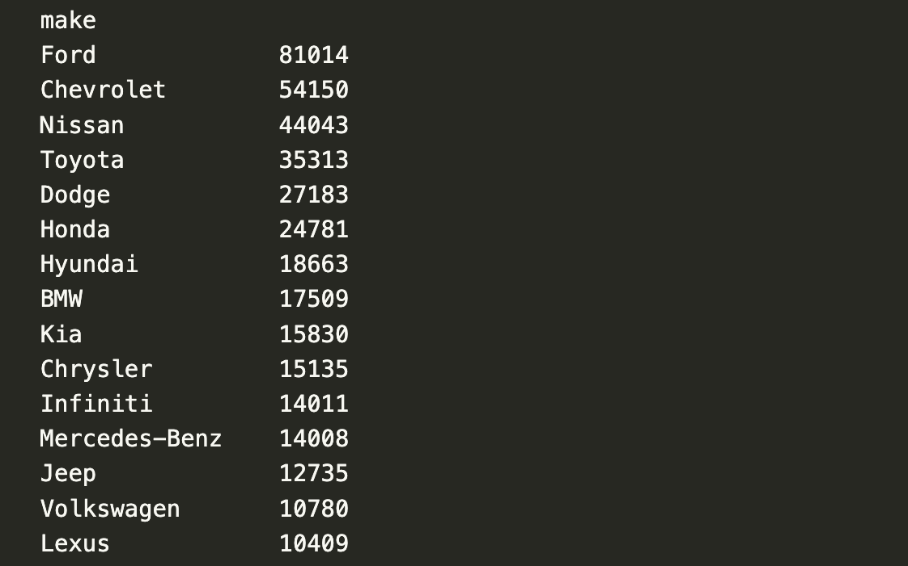
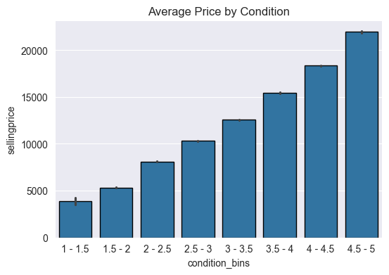
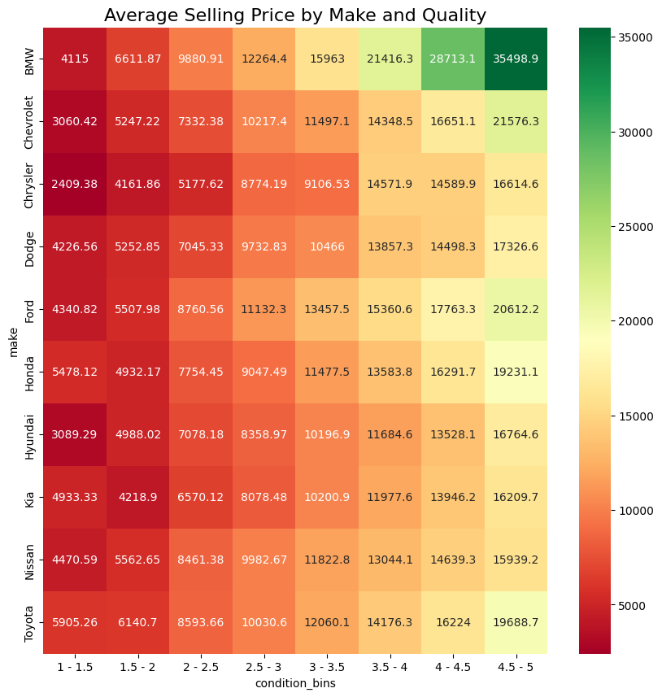
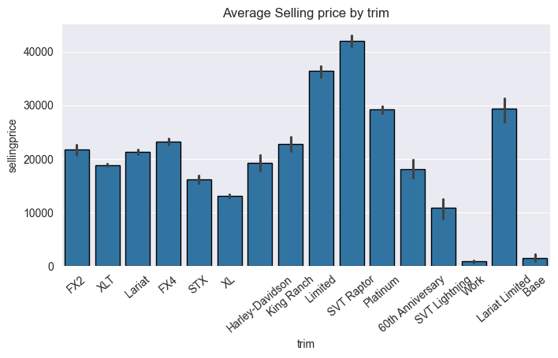
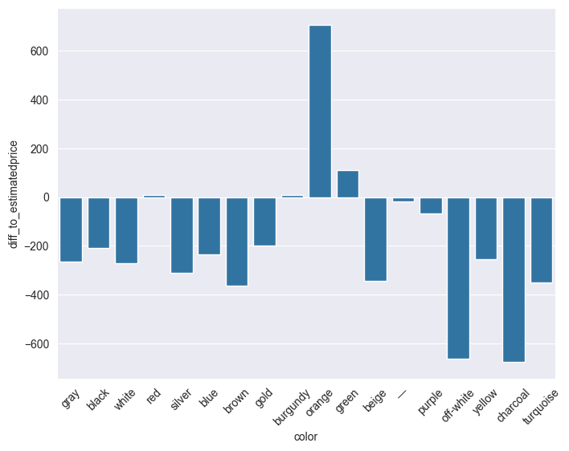
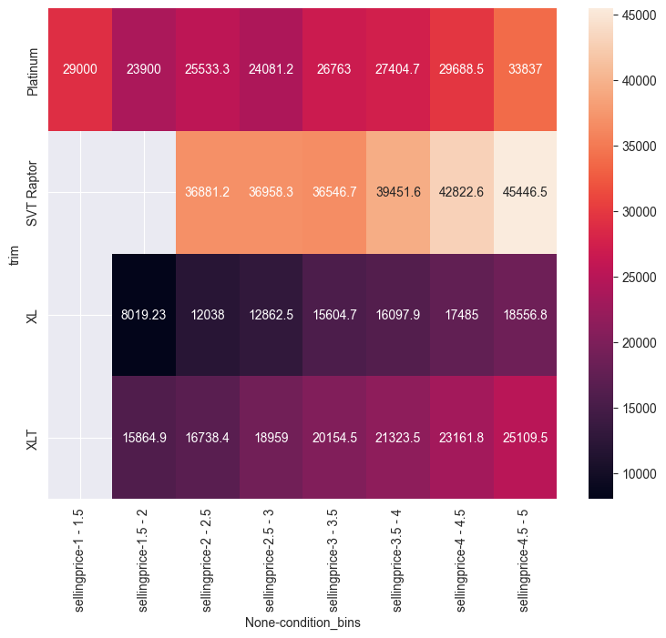
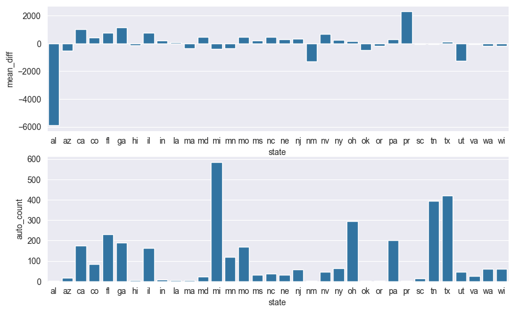

# Fleet Wagon

Python | Jupyter notebook | Pandas | Matplotlib | Seaborn

# Pitch

Fleet Wagon, a car leasing company, has built a strong reputation for providing cost-effective vehicle solutions to contractors and businesses. Recently a surge in demand has outrun the availability of vehicles from traditional suppliers. Fleet Wagon must now explore alternative procurement options so the company has identified the automotive auction industry as a source for acquiring vehicles.

Since the auction market is very competitive, Fleet Wagon has to make they get the best deals while also considering factors such as vehicle condition, price, and auction locations, in order to make all this happen Fleet Wagon has turned to a data analyst to identify optimal procurement strategies.

# Motive

To conduct a comprehensive data analysis of the automotive auction industry to identify the best car deals and ideal locations for procurement, enabling Fleet Wagon to meet its increased demand for vehicles while maintaining cost efficiency and quality standards.

Key information that needs to be addressed:

- Highest selling Cars.
- The car fleet wagon is interested in.
- The colors that sell more than the recommended price.
- Average selling prices for different makes and quality levels.
- Average selling price by trim.
- The best state to buy the cars in.

# Data

- Data source : https://drive.google.com/file/d/1KULXyh0n5vrvWo-rSimq74BVmAZyLkEO/view?usp=share_link
- Reading in the dataset `car_prices.csv` we get over 550,000 row of records for the automotive data.
- The dataset is available in this repository in the file `car_prices.csv`.
- Important information in the data include:
'`year`', '`make`', '`model`', '`trim`', '`state`',
       '`condition`', '`odometer`', '`color`', '`mmr`',
       '`sellingprice`', '`saledate`'

# Data cleaning and manipulation

- Check for missing values.
- Rename specific columns for convenience.
- Filter the dataframe down to relevant columns.

# Topics Addressed and their Outcomes

### The Highest selling Cars.

### The car fleet wagon is interested in:

   * fleet wagon is interested in the highest selling car which is ford f-150.

   * Bining the `condition` variable into increments of .5. For example, the first bin will be '1-1.5', the second '1.5-2', and so on up until the maximum condition value of 5. Using pd.cut() to create the bins.

   * Building a barplot of the average price by condition bin.

### Average selling prices for different makes and quality levels.

   * We are mostly interested in purchasing highest selling car, specifically the Ford F-150, the highest selling automobile for decades in the US.

   * Building a barplot of `sellingprice` by `trim` for the F150s.

To calculate MAPE, concise explanations and formulas for each term:

1. **SP (Selling Price)**:
   - The actual price at which a product is sold.
   - Notation: \( SP \)

2. **IB (Industry Benchmark)**:
   - The expected or standard selling price for a product as recognized in the industry.
   - Notation: \( IB \)

3. **Absolute Deviation**:
   - The absolute difference between the selling price and the industry benchmark.
   - Formula:Absolute Deviation = |SP - IB|

4. **Absolute Percentage Error**:
   - abs_error = (abs(actual - predicted) / actual) * 100.

5. **MAPE (Mean Absolute Percentage Error)**:
   - The average absolute percentage difference between the selling prices and industry benchmarks.
   -  MAPE = abs_error.mean()

5. **Accuracy**:
   - accuracy = 100 - mape

6. In our case:
   - SP is selling price
   - IB is mmr/estimated price
   - MAPE = 22%
   - Accuracy = 78%

### Which color sells for more than the recommended price?

###  Further filtering the data to the trims. Excluding the color 'orange' and taking only trucks from year between 2009 and 2014. 

### What is best state to buy ford f-150s in?

* fleet wagon has decided on the XLT model, it has more features than XL but is still quite affordable. Also filtering out any trucks with a quality of less than 3.5. the DataFrame should only have trucks with a quality of 3.5 or greater.
* now, building a subplot with a bar chart of `state` by `diff_to_estimatedprice` and `state` by `count` to find which states sell XLT models below estimated price.

* So looks like Utah, `state=='ut'` has a good amount of quantity and a low average price.